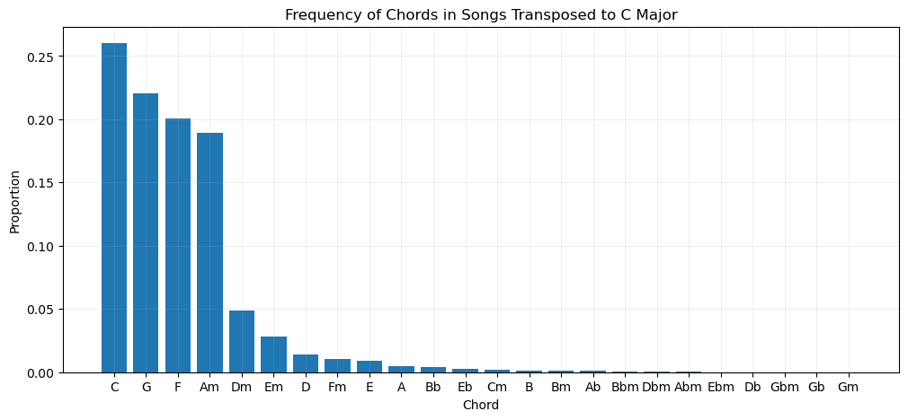

# Frequency of Chords in Popular Music
## Background
It is commonly said that popular music often boils down to just four "essential" chords. These chords are I, V, iv, and IV; or in the key of C major; C, G, Am, and F. While this phenomenon has been well-known for a long time, it was made especially popular from the song "Four Chords" by The Axis of Awesome, which went viral in the early 2010s. In the live version, Benny Davis states that "All the greatest hits from the past 40 years just use four chords. Same four chords for every song, it's dead simple to write a pop hit." While this was largely focused on pop music, the same observation has been made in country, rock, and punk rock music. As mentioned before, this is not new information - but how frequent are these four chords, exactly?
## Data
To collect data on chords, I webscraped data from Ultimate Guitar. Using the main search page, I collected the 250 most popular chord tabs. For each song, I collected the song's key, capo setting, and a full list of the song's chords from start to finish.

Using the key and capo setting, I was able to transpose these chords to C major. Since a lot of chord tabs were denoted incorreclty, I filtered out obvious anomalies and ended up with 169 songs to analyze. This measured out to 18,036 chords, an average of 106 chords per song. While it is inevitable that some of these chords are incorrect due to incorrect tab writing, my assumption is that because my selection includes the most popular tabs on the website, and comment/rating feedback exists, most of the tabs will be correct.
## Results
### Main Results
In C major, the chords I, V, iv, and IV are C, G, Am, and F, respectively. Based on their title as "*the* four chords" of popular music, the expectation is that they should have the highest frequency.

As expected, it is clear from the graph that these four chords (C, G, F, Am) are indeed the most common. On their own, they make up about 87% of all chords in the dataset. 

It's certainly true that these four chords are used disproportionately often. However, it would be a stretch to say that these are the only chords necessary, even as an exaggeration. While about 78% of songs use all four of these chords, only about 22% use these four chords *exclusively*.
### Additional Results
Unsurprisingly, all diatonic chords (except for Bdim) are more common than all non-diatonic chords, and make up nearly 95% of all chords. However, there are some non-diatonic chords that appeared at non-negligeable frequencies.

The first chords worth mentioning are D, E, and A (major). These chords are less common than their minor versions, but often appear as dominant 7th chords (D7, E7, A7) in C major, even though these are non-diatonic. However, since my manipulation process removed all extensions (7ths, 9ths, etc.) and only included qualities, these chords only show up as D, E, and A major.

Another interesting case is Fm (iv in C major). This chord is less common than F major, but often appears in a minor plagal cadence, typically in the sequence IV - iv - I.

The last chord i will mention is Bb (bVII in C major). This chord is not diatonic in major nor minor, and often appears as a borrowed chord from the parallel minor. However, this could also be an effect of songs being written in Mixolydian but analyzed in Ionian. For instance, American Idiot by Green Day is a in Ab Mixolydian, and its main riff is arguably best analyzed as I - IV - VII - VI - I - VII. However, since my manipulation assumes the key to be Ab major, the main riff would instead be analyzed as I - IV - bVII - VI - I - bVII. 
